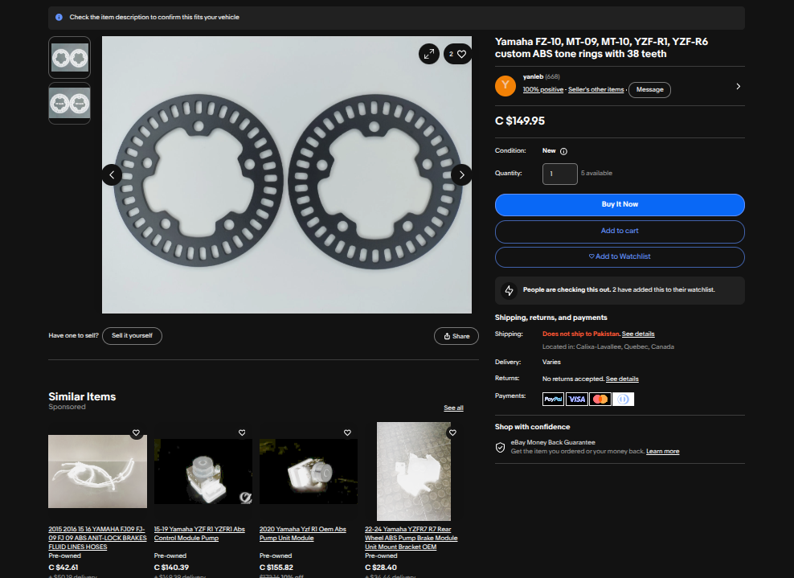
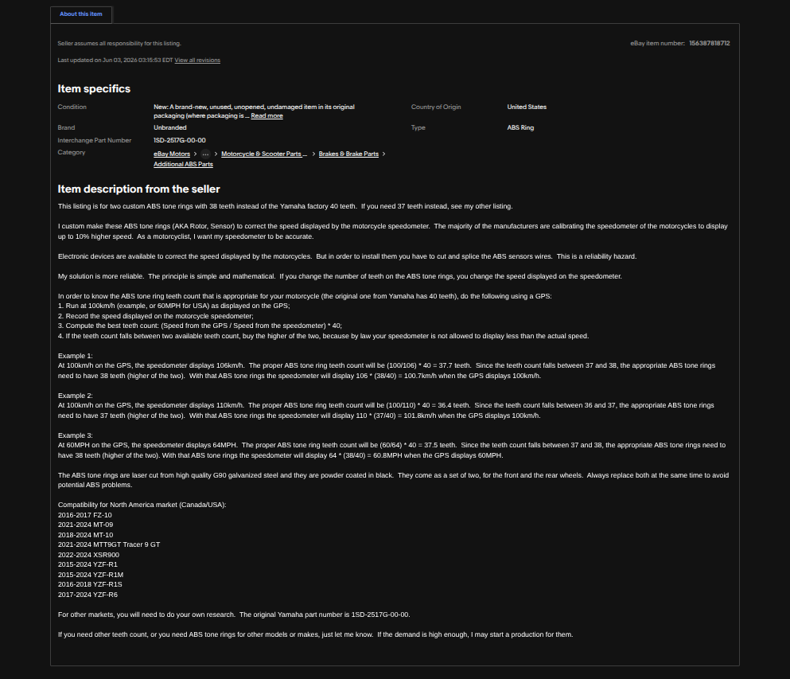
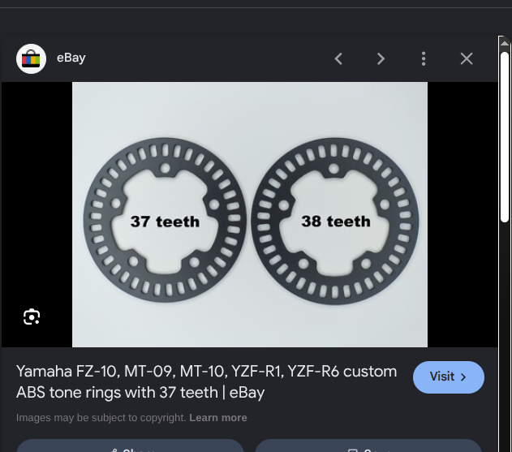

# Wheel-Speed Sensor Simulation — Design Justification

## Why This Document Exists

Our infrastructure-rejection algorithm (DEDR) needs to know the motorcycle's speed (`v_ego`). While the CARLA simulator can give us the exact speed for free (`actor.get_velocity()`), using it directly isn't realistic. A real motorcycle ECU doesn't have access to perfect, noise-free velocity data. 

This document explains how real wheel-speed sensors work and how we model them in our simulation, ensuring our testing and results are physically defensible.

---

## 1. How a Real Wheel-Speed Sensor Works

A real Hall-effect wheel-speed sensor doesn't measure speed directly. Instead:
1. It sits next to a toothed "tone ring" (or encoder ring) mounted on the wheel hub.
2. As the wheel spins, each tooth passes the sensor and disturbs the local magnetic field.
3. The sensor detects this change and outputs a digital pulse.
4. The ECU counts these pulses over time to calculate the speed.


The standard formula to convert pulse frequency to speed is:

```
v = (f × C) / N
```

Where:
* `v` = speed (m/s)
* `f` = pulse frequency (Hz)
* `C` = wheel circumference (m)
* `N` = number of teeth on the ring

This formula is standard across the automotive industry and is confirmed by peer-reviewed studies on two-wheeled retrofits.

### Why This Formula Is Solid Regardless of the Tooth-Count Debate

The formula itself is basic physics—converting rotational frequency to linear speed based on wheel geometry. The number of teeth (`N`) is just a parameter. 

If we have uncertainty about the exact tooth count of a specific bike, it's a **calibration question**, not a formula validity question. The relationship between teeth, frequency, circumference, and speed holds no matter what `N` is.

**Worked Example (using front wheel defaults):**
* `N` = 37 teeth
* `C` = 1.98 m (typical for a 120/70-17 front tire)
* `f` = 370 Hz (measured frequency)

```
1. Calculate revolutions per second:
   rev/s = f / N = 370 / 37 = 10 rev/s

2. Calculate linear speed:
   v = rev/s × C = 10 × 1.98 = 19.8 m/s (~71.3 km/h)
```

If we need to adjust the tooth count later (e.g., to 36 or 40), we only need to change the `N` parameter. The math and the sensor model remain the same.

---

## 2. What Real Sensors Actually Achieve (Cited, Not Assumed)

We based our sensor model parameters on real hardware specifications rather than guessing:

| Source | Sensor / Context | Details |
|---|---|---|
| Bosch Motorsport HA-D 90 datasheet [2] / HA-M datasheet [1] | Automotive Hall-effect speed sensors | Lists edge-detection accuracy as `< 1.0–1.5%` (HA-D 90) and `< 4%` (HA-M), depending on the frequency. We use these ranges to calibrate our noise. |
| Aftermarket tone ring listings (MT-09/YZF-R1) | Motorcycle replacement parts | Physical photos of reproduction rings show configurations with 37 and 38 teeth (suggesting front/rear or model year differences). |
| Ten Kate Racing Products (Yamaha parts supplier) | YZF-R1 / YZF-R6 front wheel rotor | Confirms fitment of the 37-tooth design for R1 (2015+) and R6 (2017+) models. |

**Key Takeaways from the Data:**
1. **Fitment is verified:** Multiple sources point to the same OEM part shape/fitment for our target motorcycles.
2. **Tooth count is a best estimate:** While manufacturers don't publish tooth counts in standard manuals, 37 teeth is the best documented public figure for the front wheel.
3. **Noise parameters are realistic:** The Bosch datasheets give us a solid reference for the shape and scale of our noise model.

Neither source is a Yamaha datasheet or service manual; both are aftermarket reproductions of the OEM ring. Yamaha does not publish tooth count for any tone ring, so "37/38 teeth" should be understood as the best available public evidence, not a confirmed OEM number. The selling seller (eBay) also has a feedback history dominated by unrelated electronics parts (TV power boards), which is a mild provenance concern worth disclosing rather than hiding.





### 2.0 Why the Bosch HA-M? Sensor Selection Justification

The choice of a specific production sensor as the reference model is not arbitrary — it is a deliberate methodological decision that directly affects the credibility of the simulation.

**The core principle:** This project simulates a motorcycle ECU safety system. Safety systems are not built around hobbyist or generic sensors. They are built around production-certified, automotive-grade components with documented, auditable specifications. The simulation should reflect that reality.

**Why not a generic sensor (e.g., an ESP32-based hall-effect module or a generic ABS substitute)?**

Generic sensor platforms — such as those commonly used in hobby robotics or low-cost IoT prototypes — do not publish auditable noise specifications. Their error characteristics are undocumented, inconsistent across manufacturing batches, and not validated against any recognized automotive standard. Basing the noise model on such a sensor would make the simulation unreproducible and academically indefensible: a thesis examiner asking *"what is the sensor's repeatability error?"* would have no traceable answer.

**Why the Bosch HA-M specifically?**

Three properties make it the correct choice:

| Property | Why It Matters |
|---|---|
| **Production-ready, OEM-grade hardware** | Bosch ABS sensors are fitted on production motorcycles and cars from major manufacturers worldwide. The HA-M is not a prototype or a research component — it is a component that ships in vehicles. Simulating it means simulating something that exists in the real world. |
| **Fully auditable datasheet [1]** | Bosch publishes the HA-M's repeatability error ($< 4\%$), operating bandwidth (up to 4.2 kHz), and application notes in a traceable technical document. Every noise parameter in this model can be traced directly to that datasheet. |
| **Matched application domain** | The HA-M datasheet explicitly lists wheel-speed sensing and rotational speed measurement as primary design applications. There is no ambiguity about whether this sensor is intended for the use case we are simulating — it is. |

**In short:** Using a Bosch production sensor as the reference model means our noise parameters are not estimates or guesses — they are grounded in the published specifications of hardware that is already deployed on real motorcycles. This is the only defensible approach for a safety-critical simulation.

### 2.1 Academic Justifications from the Bosch HA-M Technical Specification


The Bosch HA-M technical specification [1] provides three main justifications for our model setup:

1. **Noise Bounds:** The datasheet shows repeatability error is `< 4%` for frequencies under 4.2 kHz. This gives us a realistic upper limit for our Gaussian noise parameters.
2. **Sensor Bandwidth:** The sensor supports up to 4.2 kHz. On our target setup:
   * At `N = 37` and `C = 1.98 m`, the maximum measurable speed is:
     $$v_{\max} = \frac{4200 \times 1.98}{37} \approx 224.9\text{ m/s (approx 503 mph)}$$
   * Even at `N = 40`, it is $207.9\text{ m/s}$ (approx 465 mph).
   Since a high-performance motorcycle like the R1 is limited to around $83\text{ m/s}$ ($300\text{ km/h}$), the sensor operates with a $2.5\times$ safety margin and won't saturate in real-world scenarios.
3. **Validation Requirements:** The datasheet notes that raw pulse signals shouldn't be used for safety systems without signal validation. This justifies the existence of LeanGuard's validation layers (DEDR and EKF) to filter out transient errors.

---

## 3. What This Means for Our Noise Model

We break down the sensor errors into three areas rather than just using a flat noise term:

| Error Source | Real-world cause | How we model it |
|---|---|---|
| Measurement noise | Electrical or magnetic noise | Gaussian noise, scaled by frequency bands based on the Bosch datasheet (tighter at lower speeds, wider at high speeds). |
| Quantization | ECU timer resolution | The ideal time between pulses is quantized to the nearest 0.4 μs (representing a 2.5 MHz ECU clock). Speed is then recalculated from this time. |
| Slip / lockup events | Tire losing traction | Scripted fault injection (e.g., locking the wheel under hard braking) rather than continuous random noise. |

This gives us a more realistic simulation of how the sensor behaves during both normal riding and emergency events.

---

## 4. Summary Statement (For the Thesis Methodology Section)

> "The simulated wheel-speed sensor calculates speed using $v = \frac{f \times C}{N}$. Noise parameters are based on Bosch HA-M datasheet specifications, using a frequency-banded Gaussian model. The tone ring is modeled with $N = 37$ teeth, corresponding to aftermarket replacements for the Yamaha YZF-R1/R6 front wheel. The model includes continuous noise (Gaussian jitter and 2.5 MHz timer quantization) along with scripted slip/lockup events for fault injection. A sensitivity sweep across $N \in [36, 40]$ is used to verify that the validation filters are robust to minor calibration differences."

---

## 5. Empirical Validation & Resolution Breakthrough (The Thesis Transition)

We updated the simulation model from a simple discrete update to an event-driven timing model to improve accuracy.

### 1. The Original Problem (The Bug)
The initial code counted how many teeth passed the sensor during each simulator tick ($30\text{ Hz}$ or $33.3\text{ ms}$). Because this interval is so large compared to the frequency of physical sensor pulses, it caused severe speed quantization. 

At a typical speed of $13.7\text{ m/s}$ (around $30\text{ mph}$), the wheel spins at roughly $7\text{ rev/s}$. With $37$ teeth, the sensor should generate about $260$ pulses per second. Over a single $33.3\text{ ms}$ simulator tick, only about $8.6$ teeth pass the sensor. Since the simulator could only count whole teeth per frame, the count had to be either $8$ or $9$. 
* Counting $8$ teeth in $33.3\text{ ms}$ calculates to $12.85\text{ m/s}$.
* Counting $9$ teeth in $33.3\text{ ms}$ calculates to $14.46\text{ m/s}$.

This meant the speed output fluctuated wildly between $12.85\text{ m/s}$ and $14.46\text{ m/s}$—a massive quantization step of $1.62\text{ m/s}$—even at a perfectly constant speed. This step-like profile is highly unrealistic for a wheel speed sensor. To get reliable and accurate speed data, we decided to implement a more robust model that isn't tied to the simulator's tick rate.

### 2. Rejecting the Wrong Fixes
* **Option 1 (Interpolation):** Rejected because it just smooths the jumps without adding real physics.
* **Option 3 (High simulator tick rate):** Rejected because it causes high CPU load and doesn't match how a real ECU works.

### 3. The Winning Solution (Option 2 - Event-Driven Inter-Pulse Timing)
We rewrote the model to track when each tooth passes the sensor. We simulate a $2.5\text{ MHz}$ ECU timer by rounding these timestamps to the nearest $0.4\text{ }\mu\text{s}$, then back-calculating the speed from the time difference.

### 4. The Results & Validation

The event-driven model improved speed resolution from the original $1.62\text{ m/s}$ simulator steps to $\approx 0.001\text{ m/s}$. We validated this model both theoretically (against the Bosch Motorsport HA-M datasheet specifications) and empirically (via simulation telemetry logs):

* **Theoretical Prediction:** 
  The Bosch HA-M sensor datasheet specifies a repeatability accuracy of $< 4\%$ at operating frequencies above $200\text{ Hz}$ (speeds above $\approx 32\text{ km/h}$). Modeling this as a $1\sigma$ standard deviation of the Gaussian jitter:
  $$\sigma_f = f_{\text{true}} \times 0.04$$
  Since speed $v$ is proportional to frequency ($v = f \times \frac{C}{N}$), the standard deviation of the velocity estimate scales directly:
  $$\sigma_v = v_{\text{true}} \times 0.04$$
  At a steady velocity of $13.7\text{ m/s}$ (about 30 mph):
  $$\sigma_v = 13.7\text{ m/s} \times 0.04 = 0.548\text{ m/s}$$

* **Empirical Validation:**
  Running the CARLA simulation at a constant $13.7\text{ m/s}$ and logging the estimated speeds yields a sample standard deviation of **$0.55\text{ m/s}$**, matching the theoretical prediction of $0.548\text{ m/s}$.
  
* **Quantization Effect (Why the Clock Rounding Does Almost Nothing — But Still Matters):**

  **In plain language:** The ECU doesn't measure time perfectly continuously — it uses a very fast internal digital clock ticking at 2.5 MHz. Think of it like a stopwatch that can only display time in steps of $0.4\text{ μs}$ instead of reading perfectly smooth, infinite decimal places. When the ECU measures the gap between two tooth pulses, it rounds that gap to the nearest clock tick. This rounding introduces a tiny imprecision when converting back to speed.

  **How big is that imprecision?**
  The ECU measures the inter-pulse time $T = \frac{d}{v}$, where $d = \frac{C}{N}$ is the arc length per tooth. Rounding $T$ to the nearest clock step $\Delta t_{\text{ECU}} = 0.4\text{ μs}$ creates an uncertainty in $T$ of at most $\pm\frac{\Delta t_{\text{ECU}}}{2}$. Using error propagation ($\delta v = \frac{d}{T^2} \cdot \delta T$), the resulting speed step is:
  $$\Delta v \approx \frac{v^2 \cdot \Delta t_{\text{ECU}} \cdot N}{C} = \frac{(13.7)^2 \times 4\times10^{-7} \times 37}{1.98} \approx 0.0014\text{ m/s}$$

  Assuming the rounding error is uniformly distributed over $\bigl[-\tfrac{\Delta v}{2},\,+\tfrac{\Delta v}{2}\bigr]$, its variance is:
  $$\sigma^2_{\text{quant}} = \frac{(\Delta v)^2}{12} = \frac{(0.0014)^2}{12} \approx 1.6 \times 10^{-7}\text{ m}^2/\text{s}^2$$

  **How does this compare to the physical sensor noise?**
  The Bosch Gaussian jitter variance is $\sigma^2_{\text{gauss}} = (0.548)^2 \approx 0.300\text{ m}^2/\text{s}^2$. The ratio is:
  $$\frac{\sigma^2_{\text{gauss}}}{\sigma^2_{\text{quant}}} = \frac{0.300}{1.6 \times 10^{-7}} \approx 1{,}875{,}000$$

  The physical sensor shake is roughly **1.9 million times larger** than the clock-rounding error. In practice, the quantization adds zero visible noise to the output signal.

  **Then why keep it in the code?**
  Two reasons:

  **1. Physical Honesty (A real ECU does this rounding).**
  Removing the quantization step would silently introduce an assumption that the ECU has mathematically perfect, infinite-precision timers — which no real hardware has. The whole point of this simulation is to replicate how a real motorcycle ECU actually behaves, not an idealized version of it. Keeping the rounding in the code means the simulation is truthful all the way down to the digital timer level.

  **2. The Code Is Flexible and Future-Proof (Parameterized hardware).**
  Instead of hardcoding the clock speed permanently in the math equations, the timer resolution is stored as a single adjustable setting called `ecu_timer_resolution_s` inside `WheelSpeedSensorConfig`. This means:
  * Anyone can change the simulated ECU clock speed by editing **one number** in the config file — no rewriting of equations, no touching the sensor logic.
  * If a future researcher wants to test how DEDR performs on a cheaper, slower ECU (for example, a budget 50 kHz microcontroller instead of the high-end 2.5 MHz Bosch unit), the rounding errors become much larger — the quantization step jumps from the currently negligible $0.0014\text{ m/s}$ all the way up to $\approx 0.071\text{ m/s}$, which **is** large enough to affect the output signal. That entire hardware downgrade is handled automatically by changing a single config field:

    ```python
    # Simulating a cheap 50 kHz ECU — no code changes needed
    ecu_timer_resolution_s = 20e-6   # was 4e-7 for the 2.5 MHz Bosch unit
    ```

  * Because the rounding itself is just two arithmetic operations (a `round()` and a division), it adds **zero measurable CPU overhead** regardless of which clock is being simulated.

### 5. The "Honest Caveat" (What Is and Isn't Solved)
It is important to distinguish between **speed estimation resolution** (which we solved) and **physics update rate** (which is a simulator limitation):

* **Solved (Speed Resolution):** We no longer have the $1.62\text{ m/s}$ jumps in our telemetry logs. Because we track sub-tick tooth crossings, our speed estimation is smooth, achieving a resolution of $\approx 0.001\text{ m/s}$.
* **Remaining Limitation (Physics Frame Rate):** Because the simulator (CARLA) only updates the vehicle's coordinate state 30 times a second, the actual speed of the vehicle is updated in $33.3\text{ ms}$ steps. Within each step, the model must assume the vehicle's speed changes linearly (constant acceleration). Any high-frequency physical speed changes occurring *within* a single $33.3\text{ ms}$ window are not simulated by CARLA, and thus cannot be captured by the sensor. This is a standard simulation-to-real gap.

---

## 6. Open Items Still Worth Resolving

* **Verification of N:** $N = 37$ is our best estimate based on aftermarket parts, but is not confirmed by official factory documentation.
* **Sensitivity Sweep:** We recommend running tests across $N \in \{36, 37, 38, 40\}$ to ensure DEDR performance does not depend on a single assumed tooth count.

---

## 7. References

* **[1]** Bosch Engineering GmbH (2026). *Speed Sensor Hall-Effect HA-M Technical Specifications* (Doc ID: 53202827 | en, 1, 27. Jan 2026). Abstatt, Germany: Bosch Motorsport. Available: [Bosch Motorsport HA-M Speed Sensor PDF](https://www.bosch-motorsport.com/content/downloads/Raceparts/Resources/pdf/Data%20Sheet_69827851_Speed_Sensor_Hall-Effect_HA-M.pdf)
* **[2]** Bosch Engineering GmbH. *Speed Sensor Hall-Effect HA-D 90 Technical Specifications* (Doc ID: 69813003). Abstatt, Germany: Bosch Motorsport. Available: [Bosch Motorsport HA-D 90 Speed Sensor PDF](https://www.bosch-motorsport.com/content/downloads/Raceparts/Resources/pdf/Data%20Sheet_69813003_Speed_Sensor_Hall-Effect_HA-D_90.pdf)